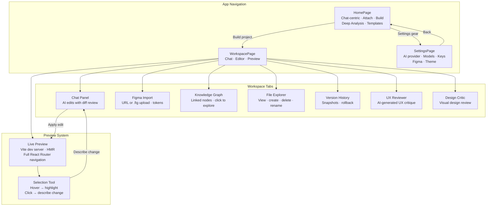

# Dost Studio — Local-First AI App Builder | Turn Ideas into React Apps

> **Turn plain-text ideas into running React apps with AI. No cloud lock-in. No per-seat billing. Runs on your machine.**

Dost Studio is a **local-first AI app builder** and **AI code generator** that turns a plain-text product idea into a running, multi-page React application — PRD, architecture, components, routes, live preview, and AI-powered iteration — all without leaving your browser. It's the best free AI app builder for developers who want full control over their code and data.

If you've searched for **"AI app builder free"**, **"local AI code generator"**, **"AI React app builder"**, or **"self-hosted AI product builder"** — you've found the right project. Dost Studio is open-source, runs entirely on your machine, and supports both local AI (Ollama) and cloud AI (OpenRouter).

---

## Why Dost Studio beats AI code generators

Most AI coding tools are chat interfaces bolted onto a file system. Dost Studio is a **local-first AI product building platform** — a complete AI app generator with persistent memory, multi-agent code generation, live preview, and built-in deep research.

| AI Code Generator | What it does | Dost Studio advantage |
|---|---|---|
| Cursor / Windsurf | AI-assisted code editing | Dost generates the **entire app** from a prompt — not just snippets |
| Bolt.new / Lovable | One-shot cloud generation | Dost is **local-first** — your code never leaves your machine unless you choose cloud AI |
| v0.dev | Component generation | Dost builds **full multi-page apps** with routing, PRD, and architecture |
| GitHub Copilot | Autocomplete | Dost is a **product operating system** with persistent brain, version control, and deep research |

---

## Quick start — install and run in 30 seconds

```bash
git clone https://github.com/yourusername/dost-studio.git
cd dost-studio
npm install
npm run dev
# → http://localhost:5173
```

**Prerequisites:** Node.js 18+ and either [Ollama](https://ollama.com) (free, local) or an OpenRouter API key (free tier available).

---

## What Dost Studio does — the AI app building pipeline

Type a product idea. Press **Build**. Dost Studio, the AI app builder, will:

1. **Enhance your prompt** into a structured product brief (choose from 10 writing styles)
2. **Generate a PRD** (features, personas, user stories, success metrics)
3. **Design the architecture** (routes, components, database schema, API endpoints)
4. **Write every React/TypeScript source file** with proper default exports and routing
5. **Start a Vite dev server** with the live app
6. **Show you the running product** in the Preview panel — with full navigation

Then open the Chat panel and say *"Add dark mode"* or *"Make it responsive on mobile"* — see the diff, apply it, refresh the preview. No context switching. No scaffolding.

---

## Visual tour

### Homepage — chat-centric AI app builder


A chat-centric conversation interface. Type your idea, press **Build**. Or enhance first, or run a **Deep Analysis** to gather market intelligence using your local AI model. The full conversation history (prompts, enhanced briefs, research findings, build progress) scrolls above the input. Start fresh or pick a template.

### Workspace — AI code editor + live preview


The workspace splits into: **Chat panel** (left) for AI editing with diff review cards, **Code editor** (right, front) with multi-file tabs and auto-save, and **Live preview** (right, back) showing the actual generated React app with full navigation.

### Preview — the real generated React app


Every generated app is served through a real Vite dev server. React Router navigation works. HMR is live. The selection tool (dashed outline in the screenshot) lets you hover any element and click to describe a change — the AI edits your code, and the preview updates instantly.

---

## Navigation map



All routes are served via **React Router 7** with `<BrowserRouter>` — every page in the generated app is navigable.

---

## Deep Research — conversational AI deep thinking (Kimi-style)

Click **🧠 Deep Analysis** in the toolbar to enter **research mode**. The prompt bar switches to research chat mode — type any topic and the AI provides a thorough analysis. Unlike one-shot research tools, you can have a **back-and-forth conversation**:

1. Type your initial topic → AI delivers a deep analysis with insights and implications
2. Ask follow-up questions → AI builds on previous context for deeper exploration
3. Type **`/prompt`** → AI synthesizes the full conversation into a build prompt
4. The generated prompt fills the textarea — hit **Build** to create your app

**No API keys needed** — Deep Research uses your local Ollama model (`qwen2.5-coder:1.5b`). Works 100% offline.

---

## Dark/Light theme

Toggle between dark and light mode with the sun/moon icon in the navbar. Theme preference is persisted in your settings.

---

## What you can feed the AI app builder

| Input | How |
|---|---|
| A sentence | "A SaaS dashboard for tracking GitHub repo analytics" |
| Reference code | Attach `.tsx`/`.js`/`.css` files as build context |
| Screenshots | Drop an image → Vision Agent analyzes layout, components, colors |
| `.fig` files | Drop a Figma file → parsed locally (no API key needed) → design tokens, frame hierarchy, embedded PNG vision analysis |
| Figma URL | Paste a Figma URL → REST API imports design tokens + component tree |

All inputs are combined into a single enriched prompt that feeds the AI generation pipeline.

---

## Architecture

```
Browser (React + Vite) ─── HTTP/Socket.IO ─── Express (3001)
                                                    │
                                              ┌─────┴─────┘
                                         Ollama (11434)  OpenRouter (cloud)
                                              │
                                         projects/<uuid>/
                                           ├── metadata.json  PRD, arch, files
                                           ├── brain.json     conversation context
                                           ├── graph.json     knowledge graph
                                           ├── src/           generated TSX files
                                           └── package.json   Vite project
```

### Three AI providers in one app builder

| Mode | Cost | Latency | Privacy |
|---|---|---|---|
| Local Ollama | Free (your own GPU) | Fast (no network) | 100% offline |
| OpenRouter cloud | Pay-per-token (~$0.01/build) | Medium | Your data leaves your machine |
| Auto-fallback | Key exhausted → Ollama | Graceful degradation | Transparent |

---

## The tech stack

| Layer | What |
|---|---|
| Frontend | React 19, TypeScript, Vite 8 |
| Styling | TailwindCSS 4 |
| State | Zustand 5 |
| Routing | React Router 7 |
| Backend | Express 5, Socket.IO 4 |
| AI (local) | Ollama |
| AI (cloud) | OpenRouter |
| Storage | Filesystem (`projects/`) + localStorage |

Zero database dependencies. Zero Docker. Zero cloud infrastructure. A single `npm install && npm run dev` gets you the whole AI app builder running locally.

---

## Build your own — self-hosted AI app builder setup

### Prerequisites

- Node.js 18+
- **Either** [Ollama](https://ollama.com) running locally with a model like `qwen2.5-coder:7b`
- **Or** an OpenRouter API key (free tier works)

```bash
npm install
npm run dev
```

Client: `http://localhost:5173`
Server: `http://localhost:3001`

### Ollama quick start (free local AI)

```bash
ollama pull qwen2.5-coder:7b
# or hermes3:8b, or deepseek-r1:7b, or whatever you like
```

Dost Studio auto-detects your installed models and assigns the best one to each agent role.

### OpenRouter quick start (cloud AI)

Open **Settings** → paste your API key. Default model: `deepseek/deepseek-chat` (free). Or use any model from the OpenRouter catalog.

---

## The AI agents

| Agent | What it does |
|---|---|
| **Planner** | Turns your prompt into a structured product vision |
| **Product Manager** | Generates a full PRD with features, personas, stories |
| **Architect** | Designs routes, components, state, database, API |
| **Engineer** | Writes every `.tsx` file with proper routing + exports |
| **Vision Agent** | Analyzes images and screenshots for design cues |
| **Deep Analyst** | Conversational deep research — chat with AI, then `/prompt` to synthesize |
| **AI Co-founder** | Chat edits with diff review, version control, undo |

The generation pipeline runs all agents in sequence. Each agent sees the output of the ones before it. The result is a coherent, multi-page application — not a pile of disconnected components.

---

## Preview system — live React app generation

The preview shows the **actual generated React app** — not a static HTML mock:

```
Browser → Vite (5173) → Express (3001) → Project Vite (4173+)
                    ↓                      ↓
               /preview/:id/          injects selection
               proxy route            script into every page
```

- Full React Router navigation — every page works
- HMR — edit code, see changes instantly
- Selection tool — hover any element, click to describe a change
- Falls back gracefully if the Vite dev server isn't available

---

## Chat — the AI that edits your code

Every chat message is classified as either:

**`edit`** — *"Add a dark mode toggle"*, *"Make the sidebar collapsible"*
1. AI reads all project files + brain context
2. Generates structured file diffs
3. Shows a review card with per-file `+added / -removed` counts
4. **Apply** — writes files, creates a version snapshot, saves to disk, refreshes preview
5. **Discard** — dismisses with strikethrough

**`chat`** — *"Why did you structure it this way?"*
Streams back as plain text. No file changes.

### Quick actions (empty state)

| Click | Sends |
|---|---|
| Add dark mode | "Add dark mode support with a toggle button" |
| Fix responsive | "Make the layout fully responsive on mobile" |
| Add loading states | "Add loading spinners and skeleton states" |
| Improve styling | "Improve the overall visual design and spacing" |

---

## Figma import — design to code

Two ways in:

### 1. Figma URL (REST API)

Paste any Figma file URL → fetches design tokens (colors, typography) + frame hierarchy + image renders → generates a structured code prompt → feeds into the build pipeline.

Requires a Figma personal access token (Settings → Figma Integration).

### 2. `.fig` file (local, no API key)

Drop a `.fig` file directly onto the homepage or the Figma import panel:

- Parsed **entirely in the browser** via `fflate` (no upload, no API call)
- Extracts `document.json` → design tokens + component tree
- Extracts embedded PNGs → Vision Agent analyzes every frame
- Generates the same structured prompt as the REST API path

---

## Project Brain — persistent AI memory

Every project has a persistent memory that survives refresh, tab switches, and time:

| What | Where | Why |
|---|---|---|
| Generation prompt | `brain.json` | Remember what started it all |
| Chat history | `brain.json` | Full conversation context for every edit |
| Architecture decisions | `brain.json` | Each decision logs the problem, alternatives, and chosen solution |
| File modifications | `brain.json` | Every edit is tracked with before/after |
| Knowledge graph | `graph.json` | Vision → features → pages → routes → components → files |
| Versions | `metadata.json` | Every edit creates a snapshot — rollback with one click |

---

## Export — portable React apps

Every project downloads as a portable ZIP:

```bash
# Unzip, then:
npm install
npm run dev
# → http://localhost:5173
```

Standard React + TypeScript + Vite + TailwindCSS. Works without Dost Studio. Works anywhere.

---

## Project structure

```
src/
├── components/
│   ├── chat/ChatPanel.tsx         AI engineer with diff review
│   ├── editor/EditorPanel.tsx     Code editor with tabs
│   ├── preview/PreviewPanel.tsx   Live Vite preview
│   ├── project/                   FileExplorer, KnowledgeGraph,
│   │                              ProductManager, UXReviewer,
│   │                              DesignCritic, VisionUpload,
│   │                              FigmaImport
│   └── ui/                        shadcn/ui primitives
├── pages/
│   ├── HomePage.tsx               Prompt, attach, build, project grid
│   ├── WorkspacePage.tsx          Multi-tool project workspace
│   └── SettingsPage.tsx           AI provider + model config
├── services/
│   ├── agents.ts                  Agent orchestration
│   ├── ollama.ts                  Ollama + OpenRouter client
│   ├── visionAgent.ts             Image analysis
│   ├── researchAgent.ts           AI Deep Analysis (Ollama/OpenRouter)
│   ├── figFileParser.ts           .fig ZIP parser (fflate)
│   ├── figmaAgent.ts              Figma REST API client
│   ├── figmaToPrompt.ts           Design → code prompt converter
│   ├── projectBrain.ts            Brain persistence
│   ├── knowledgeGraph.ts          Graph builder
│   ├── diffEngine.ts              LCS diff algorithm
│   ├── versioning.ts              Version snapshots
│   └── contextAwareEditing.ts     Change planning
├── stores/appStore.ts             Zustand global state
└── types/index.ts                 All interfaces

server/
└── index.ts                       Express: CRUD, proxy, preview, export
```

---

## Development

```bash
npm run server   # Express only, port 3001
npm run client   # Vite only, port 5173
npm run dev      # Both concurrently
```

---

## Frequently Asked Questions (FAQ)

### Is Dost Studio free?
Yes. Dost Studio is completely free and open-source. It runs locally on your machine. You can use Ollama for zero-cost local AI, or OpenRouter for cloud AI (free tier available).

### How does Dost Studio compare to Bolt.new or Lovable?
Dost Studio is local-first — your code never leaves your machine unless you choose cloud AI. Bolt.new and Lovable are cloud-only, meaning your code and prompts are stored on their servers. Dost Studio also generates full multi-page apps with persistent memory, not just one-shot components.

### Can I use Dost Studio without AI?
Yes. You can write code directly in the editor, import Figma files, and use the live preview. The AI agents are optional — they accelerate the process but aren't required.

### What AI models does Dost Studio support?
Dost Studio supports any model available through Ollama (local) or OpenRouter (cloud). Recommended models: `qwen2.5-coder:7b` (local), `deepseek/deepseek-chat` (cloud, free).

### Does Dost Studio work on Windows/Mac/Linux?
Yes. Dost Studio runs on any platform with Node.js 18+. It's been tested on Windows, macOS, and Linux.

### Can I export my generated app?
Yes. Every project can be exported as a portable ZIP with standard React + TypeScript + Vite + TailwindCSS. Works without Dost Studio.

### How does Deep Research work?
Click 🧠 Deep Analysis in the toolbar to enter research mode. Type any topic to start a conversation with the AI — it provides thorough analysis, and you can ask follow-up questions to explore deeper. Type **`/prompt`** to synthesize the full conversation into a build prompt, ready to build.

### Is my data private?
Yes. When using Ollama, everything runs locally — your code, prompts, and generated apps never leave your machine. With OpenRouter, data is sent to the cloud AI provider but you control which provider you use.

---

## Changelog

### Conversational Deep Research + Code Quality (latest)

- **Conversational Deep Research**: Click 🧠 Deep Analysis to enter research mode and have a back-and-forth discussion with the AI. Type `/prompt` to synthesize the full conversation into a build prompt. Replaces the old one-shot research with a Kimi-style chat flow.
- **Research mode UX**: Purple indicator bar with topic name, keyboard shortcut hint, and ✕ dismiss. Prompt bar changes to "Ask about your research topic..." with a 🧠 Send button. Enhance/style selectors hidden in research mode.
- **Code quality overhaul**: Eliminated 3-way duplication of research mode logic (Enter key / Ctrl+Enter / button → single `handleResearchAction`). Fixed stale closure race condition in conversation history via ref. `handleGeneratePrompt` no longer clears research state on error. Removed dead `generationProgress` local state and `researchData` render path.
- **Robust Ollama error handling**: `callLLM()` now detects Ollama `{ status: 'error', message }` responses and rejects instead of passing through as valid output. Fixes raw JSON errors showing in chat.
- **Improved `/api/research` system prompts**: Research chat AI told to "immediately provide substantive analysis" instead of asking generic follow-ups. Prompt synthesis AI told to "write the prompt text directly" instead of describing the format.

### AI Deep Analysis + Chat-Centric UX

- **AI Deep Analysis**: Replaced web search with Kimi-style AI deep thinking. Uses your local Ollama model or OpenRouter to analyze topics, break them into sub-areas, and provide comprehensive research summaries. No API keys needed for local models.
- **Chat-centric HomePage**: Redesigned as a conversation interface — prompt bar at the bottom, messages (prompts, enhanced briefs, research findings, build progress, errors) scroll above. Start fresh with wordmark + template quick-picks, or dive into your conversation history.
- **Theme toggle**: Sun/moon icon in navbar toggles dark/light mode. Preference persisted in settings.
- **Kimi-inspired UI refinement**: Removed heavy gradients, glowing borders, and extreme font sizes throughout. Slimmer navbar (48px), slimmer workspace sidebar (w-9), minimal card styling, cleaner settings cards.
- **Status indicator cleanup**: Server + AI status shown as two minimal dots in navbar (no text labels).

### Attachment Context Fix + UX Improvements

- **Enhance + Build**: Attachments (images, Figma files, reference code) now pass through the entire pipeline — even when "Enhance" is used first. The enhancer AI sees images/Figma data, and the PRD → Architecture → Code stages all receive design context.
- **Server port fallback**: If port 3001 is in use, the server auto-tries 3002, 3003, etc. instead of crashing with EADDRINUSE.
- **Socket auto-connect**: Socket.IO now connects through the Vite proxy (same origin) instead of hardcoding `localhost:3001`. Works regardless of Express server port, Vite port, or proxy configuration.
- **Server health indicator**: The navbar now shows a live server connection status dot with 30-second auto-ping. Red = disconnected, green = OK.
- **Broader CORS**: Socket.IO allows any Vite dev server port (5173–5199), so auto-incremented ports don't break real-time updates.

### .fig File Support

- `.fig` ZIP parsing via `fflate` — fully client-side, no API key needed
- Extracts `document.json` → design tokens + component hierarchy via existing `figmaAgent`
- Extracts embedded PNGs → Vision Agent analyzes each frame
- Feeds combined results through `figmaToPrompt` → same structured prompt as REST API
- Figma Import panel: tab toggle between **Figma URL** (REST) and **Upload .fig** (local)
- Homepage: drop `.fig` files as attachments, editable Figma prompt, auto-build
- "Use in Build" button stores pending Figma data → homepage banner → append → build
- Settings: Figma access token field

### Image + Vision Support

- Image upload on homepage (PNG, JPG, etc.)
- Auto-analysis via `visionAgent.analyzeImage()` before generation
- Editable vision analysis text — inline in attachment chips
- Images from `.fig` files also analyzed automatically

### Figma REST API Integration

- `figmaAgent.ts` — full Figma REST client (getFile, getImageRenders, extractDesignTokens, extractFrames)
- `figmaToPrompt.ts` — Figma data → structured code prompt with color palette, component hierarchy, code instructions
- Figma Import workspace panel with design token display, frame previews, component tree

### Live Preview with Navigation

- Every generated app gets a responsive navbar with links to all pages
- `Layout.tsx` auto-generated with `<Outlet />` for page content
- `App.tsx` auto-regenerated on every file change (chat edit, file create/delete, element edit)
- React Router routes wired up automatically — click any tab, navigate to that page
- New page via chat-edit → App.tsx and Layout.tsx update → navbar shows new tab
- Catch-all route positioned inside Layout wrapper for proper redirect behavior
- Mobile responsive with hamburger menu

### Multi-Key OpenRouter Rotation

- 5 API keys in rotation pool
- Auto-rotation on 401/402/429 responses
- Final fallback to local Ollama model
- Settings UI for key management with per-key status testing

### Ollama Fixes

- API path fix: `/api/generate` instead of `/generate` (the silent 404 that broke everything)
- Auto-start `ollama serve` on server boot
- Fast fallback detection (3s timeout, direct + proxy attempts)
- Graceful degradation when Ollama isn't installed

### AI Chat — Code Editing

- Intent detection routes to `edit` or `chat` mode
- Edit mode plans structured `fileEdits` via `agentSystem.planEdits()`
- Review cards show per-file diffs with expand/collapse
- Apply writes files, creates version, saves to disk, refreshes preview
- Discard dismisses with strikethrough

### Dynamic Preview (Vite Dev Server)

- `POST /api/build/:id` runs `npm install` + `startDevServer()` before marking complete
- Generated `vite.config.ts` sets `base: '/preview/<projectId>/'`
- `App.tsx` generated with `<BrowserRouter>` + `<Routes>`
- Fallback to `demo.html` if Vite dev server fails

### Project History & Export

- ZIP export with Node built-in `zlib` — zero new deps
- Project grid with last-modified sorting
- Dropdown project switcher in toolbar
- Version history panel (newest first, colored diff counts)
- Rollback to any previous version with one click
# Dost-studio

