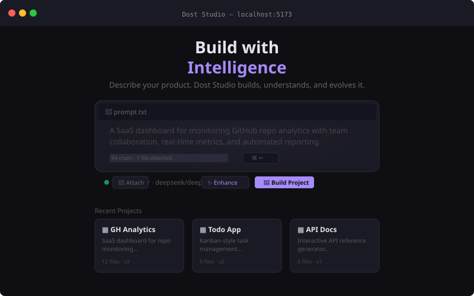
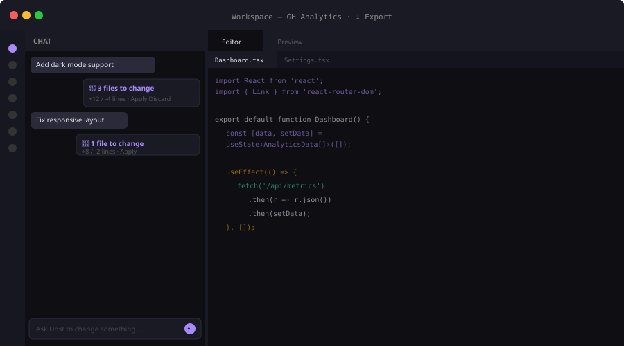
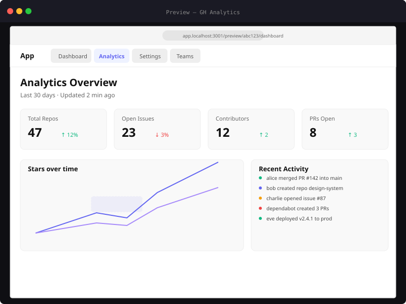

<p align="center">
  <br>
  <svg width="200" height="52" viewBox="0 0 200 52" fill="none" xmlns="http://www.w3.org/2000/svg">
    <rect x="8" y="12" width="28" height="28" rx="6" stroke="#d4a853" stroke-width="1.5" fill="none"/>
    <path d="M16 30 L22 18 L28 30" stroke="#d4a853" stroke-width="1.5" stroke-linecap="round" stroke-linejoin="round" fill="none"/>
    <circle cx="22" cy="23" r="2" fill="#d4a853"/>
    <text x="46" y="35" font-family="Georgia,serif" font-size="32" font-weight="400" fill="#f0ede8" letter-spacing="-1">dost</text>
    <text x="102" y="35" font-family="Georgia,serif" font-size="32" font-weight="400" fill="#c8b8a2" font-style="italic" letter-spacing="-1">studio</text>
  </svg>
  <br><br>
  <span style="font-size:14px;color:#8a8780;letter-spacing:0.4em;text-transform:uppercase;font-family:monospace">Think · Iterate · Build</span>
  <br><br>
  <span style="font-size:17px;color:#8a8780;max-width:500px;display:inline-block;line-height:1.6">Turn a plain-text idea into a running, multi-page React app — PRD, architecture, components, live preview — on your machine. Open source. Local-first. No cloud lock-in.</span>
</p>

<p align="center">
  <a href="#build-pipeline"></a>
  <a href="#why-dost"></a>
  <a href="#ai-providers"></a>
  <a href="#quick-start"></a>
  <a href="https://github.com/yourusername/dost-studio"></a>
</p>

<br>

```bash
git clone https://github.com/yourusername/dost-studio.git
cd dost-studio
npm install && npm run dev
# → http://localhost:5173
```

<br>

---

## Build pipeline

**Type an idea. Press Build.** Seven AI agents run in sequence — each sees the output of those before it — producing a coherent, navigable app.

```
01  Enhance prompt      →  Structured product brief from plain language. 10 writing styles.
02  Generate PRD        →  Features, personas, user stories, success metrics.
03  Design architecture →  Routes, components, state, database schema, API endpoints.
04  Write every file    →  Full .tsx files with proper routing, default exports, Layout.
05  Start Vite server   →  Live preview with HMR and full React Router navigation.
06  Iterate in chat     →  Describe a change. See a diff. Apply it. Preview refreshes.
```

<p align="center">
  
</p>

---

## Why Dost

**Not another chat-to-code wrapper.** Most AI coding tools are editors with a chat panel. Dost is a complete product-building platform with persistent memory, multi-agent generation, and local-first privacy.

| Tool | What it does | Dost advantage |
|---|---|---|
| **Cursor / Windsurf** | AI-assisted editing | Generates the **entire app** from a prompt |
| **Bolt.new / Lovable** | One-shot cloud generation | **Local-first** — code never leaves your machine |
| **v0.dev** | Component generation | Full **multi-page apps** with routing, PRD, architecture |
| **GitHub Copilot** | Autocomplete | Persistent **project brain**, version control, deep research |

| Feature | Dost Studio |
|---|---|
| 🧠 **Deep Research** | Conversational AI deep thinking — chat, then `/prompt` to build |
| 🔄 **Multi-agent pipeline** | 7 specialized agents in sequence, not one-shot generation |
| 💾 **Project Brain** | Persistent memory — every decision, edit, and conversation tracked |
| 🎨 **Figma import** | `.fig` files parsed locally (no API key) + Figma REST API |
| 🔑 **Key rotation** | 5 OpenRouter keys with auto-fallback to local Ollama |
| 📦 **Portable export** | Standard React + Vite + Tailwind — runs without Dost |

<br>

<p align="center">
  
</p>

---

## AI providers

Three modes. One app. Switch between local and cloud AI at any time.

| Mode | Cost | Latency | Privacy | Recommended model |
|---|---|---|---|---|
| **Local · Ollama** | Free | Fast (no network) | 100% offline | `qwen2.5-coder:7b` |
| **Cloud · OpenRouter** | ~$0.01/build | Medium | Data leaves machine | `deepseek/deepseek-chat` |
| **Auto-fallback** | Graceful | — | — | Ollama on key exhaustion |

---

## AI agents

Seven specialists. One pipeline. Each agent has a specific role — they chain together without disconnected outputs.

| Agent | Role |
|---|---|
| 🧭 **Planner** | Turns your prompt into a structured product vision |
| 📋 **Product Manager** | Full PRD with features, personas, user stories, metrics |
| 🏗️ **Architect** | Routes, components, state shape, database, API endpoints |
| ⚙️ **Engineer** | Writes every `.tsx` file with proper routing and exports |
| 👁️ **Vision Agent** | Analyzes screenshots and Figma frames for design cues |
| 🧠 **Deep Analyst** | Conversational research — chat with AI, then `/prompt` to build |
| 🤝 **AI Co-founder** | Chat edits with diff review, version snapshots, undo |

---

## Tech stack

**Zero database. Zero Docker.** One `npm install && npm run dev` and everything runs.

| Layer | Technology |
|---|---|
| **Frontend** | React 19, Vite 8, TypeScript |
| **Styling** | TailwindCSS 4 |
| **State** | Zustand 5 |
| **Routing** | React Router 7 |
| **Backend** | Express 5, Socket.IO 4 |
| **AI (local)** | Ollama |
| **AI (cloud)** | OpenRouter |
| **Storage** | Filesystem (`projects/`) + localStorage |

---

## Deep Research — conversational AI deep thinking

Click **🧠 Deep Analysis** in the toolbar to enter research mode — a back-and-forth conversation with your local AI:

1. **Type your topic** → AI delivers deep analysis with insights and implications
2. **Ask follow-ups** → AI builds on previous context for deeper exploration
3. **Type `/prompt`** → AI synthesizes the full conversation into a build prompt
4. **Hit Build** to create your app

No API keys needed. Uses Ollama `qwen2.5-coder:1.5b`. Works 100% offline.

---

## Inputs

| What | How |
|---|---|
| **A sentence** | `"A SaaS dashboard for GitHub repo analytics"` |
| **Reference code** | Attach `.tsx` / `.js` / `.css` files as build context |
| **Screenshots** | Drop an image → Vision Agent analyzes layout, components, colors |
| **`.fig` files** | Drop a Figma file → parsed locally (no API key) → design tokens, frame hierarchy, embedded PNG analysis |
| **Figma URL** | Paste a Figma URL → REST API imports design tokens + component tree |

All inputs combine into a single enriched prompt that feeds the AI generation pipeline.

---

## Project Brain — persistent AI memory

Every project has a persistent memory that survives refresh, tab switches, and time.

| What | Where | Why |
|---|---|---|
| Generation prompt | `brain.json` | Remember what started it all |
| Chat history | `brain.json` | Full conversation context for every edit |
| Architecture decisions | `brain.json` | Each decision logs the problem, alternatives, chosen solution |
| File modifications | `brain.json` | Every edit tracked with before/after |
| Knowledge graph | `graph.json` | Vision → features → pages → routes → components → files |
| Versions | `metadata.json` | Every edit creates a snapshot — rollback with one click |

---

## Preview system

The preview shows the **actual generated React app** — not a static HTML mock:

```
Browser → Vite (5173) → Express (3001) → Project Vite (4173+)
                    ↓                      ↓
               /preview/:id/          injects selection
               proxy route            script into every page
```

- Full React Router navigation — every page works
- HMR — edit code, see changes instantly
- Selection tool — hover any element, click to describe a change
- Falls back gracefully if the Vite dev server isn't available

<p align="center">
  
</p>

---

## FAQ

**Q: Is Dost Studio free?**  
Yes. Completely free and open-source. Use Ollama for zero-cost local AI, or OpenRouter's free tier for cloud AI.

**Q: How does it compare to Bolt.new or Lovable?**  
Dost is local-first — your code stays on your machine. Bolt and Lovable are cloud-only. Dost also generates full multi-page apps with persistent memory, not one-shot components.

**Q: What AI models does it support?**  
Any model via Ollama (local) or OpenRouter (cloud). Recommended: `qwen2.5-coder:7b` locally, `deepseek/deepseek-chat` on cloud (free tier available).

**Q: Can I export my generated app?**  
Yes. Every project exports as a portable ZIP — standard React + TypeScript + Vite + TailwindCSS. Works without Dost Studio.

**Q: Is my data private?**  
With Ollama, everything stays local — code, prompts, and generated apps never leave your machine. With OpenRouter, data goes to the cloud provider you choose.

**Q: What can I build with it?**  
SaaS dashboards, CRMs, marketplaces, AI products, landing pages, portfolios, admin panels, learning platforms — any React-based web app.

---

## Quick start

**Prerequisites:** Node.js 18+ and either [Ollama](https://ollama.com) (free, local) or an OpenRouter API key (free tier).

```bash
npm install
npm run dev
```

- Client: `http://localhost:5173`
- Server: `http://localhost:3001`

### Ollama (free local AI)

```bash
ollama pull qwen2.5-coder:7b
```

Dost Studio auto-detects your installed models and assigns the best one to each agent role.

### OpenRouter (cloud AI)

Open **Settings** → paste your API key. Default model: `deepseek/deepseek-chat` (free tier).

---

## Architecture

```
Browser (React + Vite) ─── HTTP/Socket.IO ─── Express (3001)
                                                    │
                                              ┌─────┴─────┐
                                         Ollama (11434)  OpenRouter (cloud)
                                              │
                                         projects/<uuid>/
                                           ├── metadata.json    PRD, arch, files
                                           ├── brain.json       conversation context
                                           ├── graph.json       knowledge graph
                                           ├── src/             generated TSX files
                                           └── package.json     Vite project
```

---

## Development

```bash
npm run server   # Express only, port 3001
npm run client   # Vite only, port 5173
npm run dev      # Both together
```

---

<p align="center">
  <br>
  <span style="font-size:13px;color:#5a5855;letter-spacing:0.3em;text-transform:uppercase;font-family:monospace">Think · Iterate · Build</span>
  <br><br>
  <svg width="120" height="28" viewBox="0 0 120 28" fill="none" xmlns="http://www.w3.org/2000/svg">
    <rect x="4" y="6" width="16" height="16" rx="4" stroke="#d4a853" stroke-width="1.2" fill="none"/>
    <path d="M9 18 L12 10 L15 18" stroke="#d4a853" stroke-width="1.2" stroke-linecap="round" stroke-linejoin="round" fill="none"/>
    <circle cx="12" cy="13" r="1.5" fill="#d4a853"/>
    <text x="26" y="20" font-family="Georgia,serif" font-size="18" font-weight="400" fill="#5a5855" letter-spacing="-0.5">dost studio</text>
  </svg>
  <br>
  <span style="font-size:11px;color:#5a5855">Local-first, always. — Open source </span>
</p>
